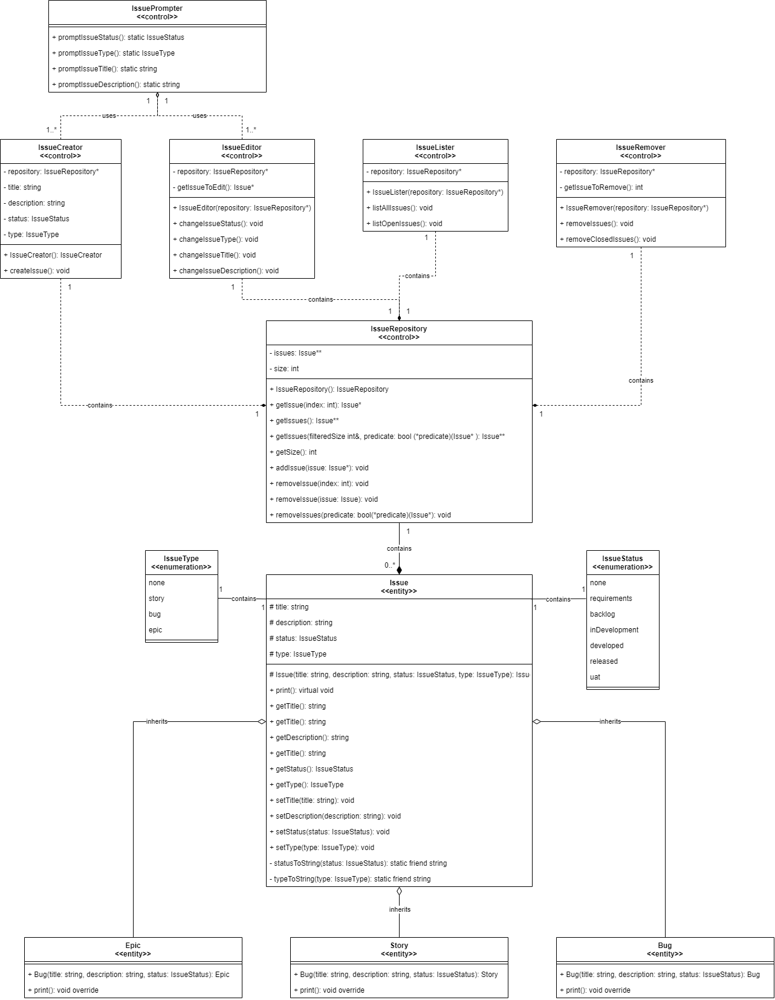

## CO650 Assignment Task 1

This repository contains the source code for my CO650 task 1 submission.

### Class Diagram



## How To Run

### Visual Studio

Open the `co650-assignment-task-1.sln` file in Visual Studio.

Press `F5` or click the debug button.

### CMake

This requires that you have CMake and a supported compiler installed, such as Visual Studio.

The project can ran from the command line using the following commands

```sh
# Create a build directory
mkdir build
cd build

# Configure & compile the project using cmake
cmake ..
cmake --build .

# Launch the built application
cd Debug
./Project.exe
```
